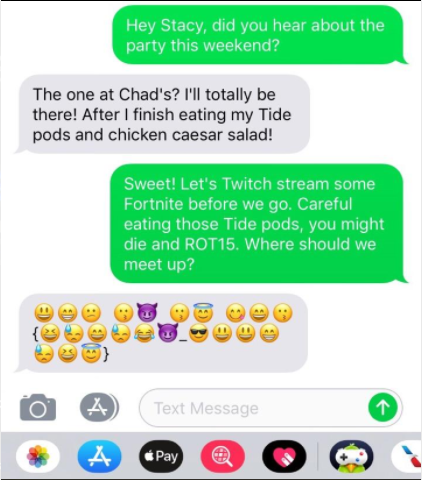

The problem gave this image and ask you to find the encrypted message inside.

The emoji are: 😃😁😕 😗😈 😗😇 😋😄😗{😆😓😄😓😂😈\_😎😃😃😁😓😆😇}, if you
want to copy it.

There are two notable things in this image: the reference to ROT15 in the third
message and the large number of emoji, plus curly braces and an underscore in
between them.

From the reference to ROT15, we thought that there would be something with
the unicode values of the emoji characters connecting to the unicode values
of the letters in the messages.

When we took the unicode values of the emoji, we noticed that they were all
between 0x1F601 and 0x1F619, which is as large of a range as the ASCII upper
case letters.

When we subtracted 0x1F5C0 from the unicode values for each of the emoji, we
got text that said, "CAU WH WG KDW{FSDSBH\_NCCASFG}".

From there, our next thought was something with rotations, because that looks
a lot like there's a flag at the end of that message. By using
[this site](http://rumkin.com/tools/cipher/caesar.php), we checked and noticed
that KDW becomes WPI (which is what the flag begins with) when rotated by
twelve positions through the alphabet. By rotating the entire thing 12 positions,
then the message becomes "OMG IT IS WPI{REPENT\_ZOOMERS}". The last part of that
is the flag.

